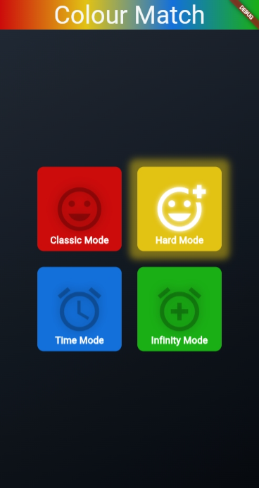

# Color Match




## a. En-tête du projet

**Color Match** est une application mobile de jeu de mémoire et de correspondance de couleurs développée avec Flutter. L'application propose plusieurs modes de jeu pour tester et améliorer votre mémoire visuelle et auditive.

## b. Description

### À quoi sert l'application ?

Color Match est un jeu de mémoire où le joueur doit reproduire une séquence de couleurs qui s'allument et produisent des sons. L'application combine la mémoire visuelle et auditive pour créer une expérience de jeu engageante.

### Fonctionnalités principales

- **4 modes de jeu différents** :
  - **Classic Mode** : Mode classique avec séquence de couleurs à reproduire
  - **Hard Mode** : Mode difficile avec plus de couleurs et séquences plus rapides
  - **Time Mode** : Mode contre la montre avec limite de temps
  - **Infinity Mode** : Mode infini pour améliorer votre score sans limite

### Public cible

- Joueurs de tous âges cherchant à améliorer leur mémoire
- Personnes intéressées par les jeux de mémoire et de réflexion
- Utilisateurs souhaitant s'entraîner à la mémoire visuelle et auditive

## c. Architecture MVVM

### Diagramme de l'architecture

```txt
┌──────────────────────────────────────────────────────────────┐
│                         VIEWS                                │
│  (lib/views/)                                                │
│  - home.dart                                                 │
│  - games/ (classic.dart, hard.dart, time.dart, infinite.dart)│
│  - widgets/ (colour_button.dart, palette_board.dart, etc.)   │
└──────────────────────┬───────────────────────────────────────┘
                       │ Observer Pattern (Provider)
                       │ Consumer<ViewModel>
                       ▼
┌─────────────────────────────────────────────────────────────┐
│                      VIEWMODELS                             │
│  (lib/viewmodels/)                                          │
│  - base_game_viewmodel.dart (classe abstraite)              │
│  - classic_game_viewmodel.dart                              │
│  - hard_game_viewmodel.dart                                 │
│  - time_game_viewmodel.dart                                 │
│  - infinite_game_viewmodel.dart                             │
└──────────────────────┬──────────────────────────────────────┘
                       │ Utilise
                       ▼
┌─────────────────────────────────────────────────────────────┐
│                        MODELS                               │
│  (lib/models/)                                              │
│  - game_state.dart (état du jeu)                            │
│  - game_palette.dart (configuration des palettes)           │
│  - mode_option.dart (options de mode)                       │
│  - constants.dart (constantes de l'application)             │
└─────────────────────────────────────────────────────────────┘
```

### Rôle de chaque dossier

#### **Models** (`lib/models/`)

Contient les classes de données et la logique métier pure :

- `game_state.dart` : Représente l'état actuel du jeu (séquence, score, état du jeu)
- `game_palette.dart` : Définit les configurations de palettes de couleurs pour chaque mode
- `mode_option.dart` : Modèle pour les options de mode de jeu
- `constants.dart` : Constantes globales (couleurs, gradients, fichiers audio)

#### **ViewModels** (`lib/viewmodels/`)

Gère la logique métier et l'état de l'application :

- `base_game_viewmodel.dart` : Classe abstraite de base avec logique commune (gestion audio, séquence)
- `classic_game_viewmodel.dart` : Implémentation du mode classique
- `hard_game_viewmodel.dart` : Implémentation du mode difficile
- `time_game_viewmodel.dart` : Implémentation du mode contre la montre
- `infinite_game_viewmodel.dart` : Implémentation du mode infini

Les ViewModels étendent `ChangeNotifier` pour notifier les vues des changements d'état.

#### **Views** (`lib/views/`)

Contient l'interface utilisateur :

- `home.dart` : Écran d'accueil avec sélection des modes de jeu
- `games/` : Écrans de jeu pour chaque mode
- `widgets/` : Widgets réutilisables (boutons de couleur, palette, etc.)

### Communication entre les composants

1. **View → ViewModel** : Les vues appellent les méthodes du ViewModel (ex: `onColorTap()`, `startGame()`)
2. **ViewModel → Model** : Les ViewModels manipulent les modèles (ex: `GameState`, `GamePalette`)
3. **ViewModel → View** : Les ViewModels notifient les vues via `notifyListeners()` (pattern Observer)
4. **View observe ViewModel** : Les vues utilisent `Consumer<ViewModel>` ou `Provider.of<ViewModel>()` pour écouter les changements

**Exemple de flux** :

```txt
Utilisateur tape une couleur
    ↓
View appelle viewModel.onColorTap(index)
    ↓
ViewModel met à jour GameState
    ↓
ViewModel appelle notifyListeners()
    ↓
View se reconstruit avec le nouvel état
```

## d. Installation et lancement

### Prérequis

- Flutter SDK installé (version 3.10.0 ou supérieure)
- Dart SDK (version 3.10.0 ou supérieure)
- Un émulateur Android/iOS ou un appareil physique

### Étapes d'installation

1. Clonez le repository :

```bash
git clone https://github.com/Emestar/flutter-mvvm-colour-match.git
cd flutter-mvvm-colour-match
```

2. Installez les dépendances :

```bash
flutter pub get
```

3. Lancez l'application :

```bash
flutter run
```

### Commandes utiles

- Vérifier les dépendances : `flutter pub outdated`
- Analyser le code : `flutter analyze`
- Nettoyer le build : `flutter clean`

## e. Fonctionnement

### Comment utiliser l'application ?

1. **Écran d'accueil** : Au lancement, vous verrez 4 boutons représentant les différents modes de jeu
2. **Sélection du mode** : Appuyez sur le mode de votre choix (Classic, Hard, Time, ou Infinity)
3. **Début du jeu** : Une séquence de couleurs s'affiche automatiquement avec des sons
4. **Reproduction** : Tapez les couleurs dans le même ordre que la séquence affichée
5. **Progression** : À chaque tour réussi, une nouvelle couleur est ajoutée à la séquence
6. **Fin du jeu** : Le jeu se termine si vous faites une erreur (sauf en mode Infinity)

### Navigation entre les écrans

- **Home → Game** : Navigation via `Navigator.push()` lors de la sélection d'un mode
- **Game → Home** : Retour via le bouton retour de l'AppBar ou `Navigator.pop()`

### Fonctionnalités clés

- **Séquence visuelle** : Les couleurs s'illuminent dans l'ordre de la séquence
- **Feedback audio** : Chaque couleur produit une note musicale unique (do, ré, mi, fa, sol, la, si)
- **Score en temps réel** : Affichage du score actuel pendant le jeu
- **Bouton Restart** : Permet de redémarrer le jeu à tout moment
- **Dialog de fin de jeu** : Affiche le score final avec options de redémarrer ou quitter

## f. Équipe

**Membres du groupe :**

- Natacha EMYER - <natachameyer@live.com>

## g. Technologies utilisées

### Packages Flutter utilisés

- **provider** (^6.1.5+1) : Gestion d'état avec le pattern MVVM via ChangeNotifier
- **audioplayers** (^6.5.1) : Lecture des fichiers audio pour les notes musicales
- **vibration** (^3.1.4) : Feedback haptique lors des interactions
- **flutter_animate** (^4.5.2) : Animations fluides dans l'interface
- **cupertino_icons** (^1.0.8) : Icônes iOS style

### Versions

- **Flutter SDK** : 3.10.0-290.4.beta (ou supérieur)
- **Dart SDK** : ^3.10.0-290.4.beta

### Packages pour MVVM

- **provider** : Utilisé pour implémenter le pattern MVVM
  - Les ViewModels étendent `ChangeNotifier`
  - Les Views utilisent `ChangeNotifierProvider` et `Consumer` pour observer les changements
  - Séparation claire entre la logique métier (ViewModel) et l'interface (View)

### Structure des assets

- **Assets audio** : `assets/sounds/` contient les fichiers MP3 des notes musicales (do.mp3, ré.mp3, mi.mp3, fa.mp3, sol.mp3, la.mp3, si.mp3)
